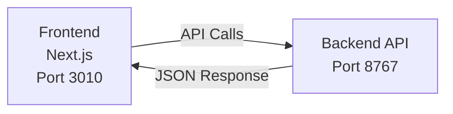
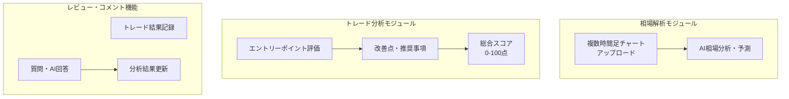
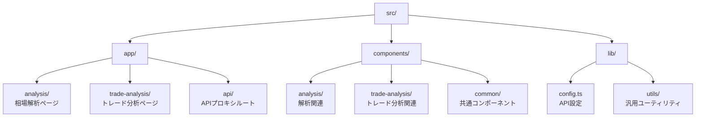

# FX Forecast Frontend

外国為替（FX）の相場分析とトレード評価を支援するWebアプリケーションのフロントエンドです。

## サービス概要

FX Forecast Frontendは、トレーダーの意思決定を支援するための包括的な分析プラットフォームです。

### 主な機能

- **マルチタイムフレーム分析**: 1分足から日足まで、複数の時間軸でのチャート分析
- **AIアシスト機能**: 画像解析による相場予測とトレード評価
- **トレードレビュー**: エントリーポイントの妥当性評価と改善提案
- **履歴管理**: 過去の分析結果の蓄積と振り返り
- **インタラクティブな質問機能**: 分析結果に対する質問とAI回答

### 対応通貨ペア

- XAUUSD（ゴールド）
- 主要通貨ペア: USD/JPY, EUR/USD, GBP/USD, EUR/JPY, GBP/JPY, AUD/JPY など

## システム概要

### アーキテクチャ



### 技術スタック

- **フレームワーク**: Next.js 15.3.4 (App Router)
- **UI**: React 19.0.0
- **言語**: TypeScript 5
- **スタイリング**: Tailwind CSS v4
- **開発ツール**: ESLint 9

### 主要モジュール



## 開発環境構築

### 必要条件

- Node.js 18.17以上
- npm または yarn
- バックエンドAPI（別途起動が必要）

### セットアップ手順

1. **リポジトリのクローン**
   ```bash
   git clone git@github.com:amptechjp/fx-forecast-frontend.git
   cd fx-forecast-frontend
   ```

2. **依存関係のインストール**
   ```bash
   npm install
   ```

3. **環境変数の設定**
   ```bash
   cp .env.local.example .env.local
   ```
   
   `.env.local`ファイルを編集し、バックエンドAPIのURLを設定：
   ```
   NEXT_PUBLIC_API_URL=http://localhost:8767
   ```

4. **開発サーバーの起動**
   ```bash
   npm run dev
   ```
   
   ブラウザで http://localhost:3010 にアクセス（ポート3010で起動します）

### 利用可能なスクリプト

```bash
npm run dev        # 開発サーバーの起動（ポート3010）
npm run build      # プロダクションビルド
npm run start      # プロダクションサーバーの起動（ポート3010）
npm run lint       # ESLintによるコード検査
```

### ディレクトリ構成



## 注意事項

- このアプリケーションはポート3010で動作します（デフォルトの3000ではありません）
- バックエンドAPIが http://localhost:8767 で起動している必要があります
- 日本時間（Asia/Tokyo）でタイムスタンプが表示されます

## ライセンス

プロプライエタリソフトウェア - 無断複製・転載を禁じます